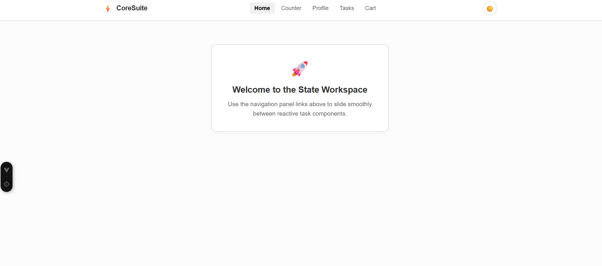
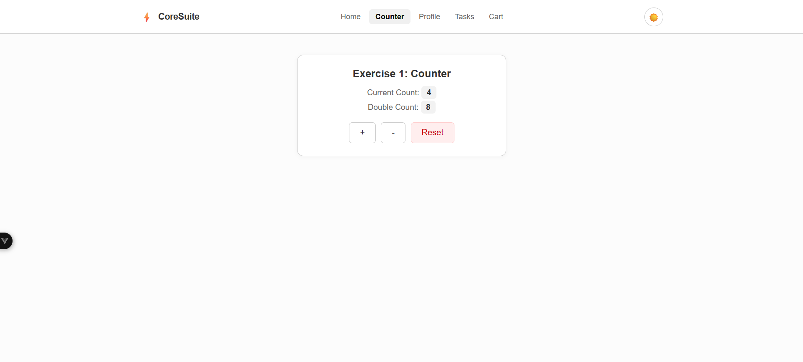
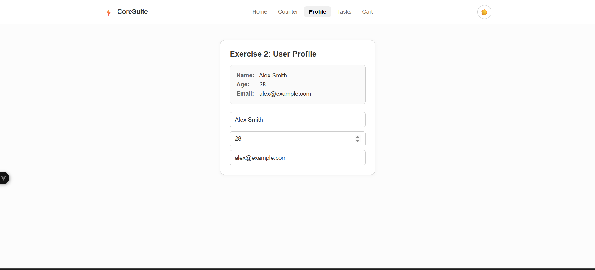
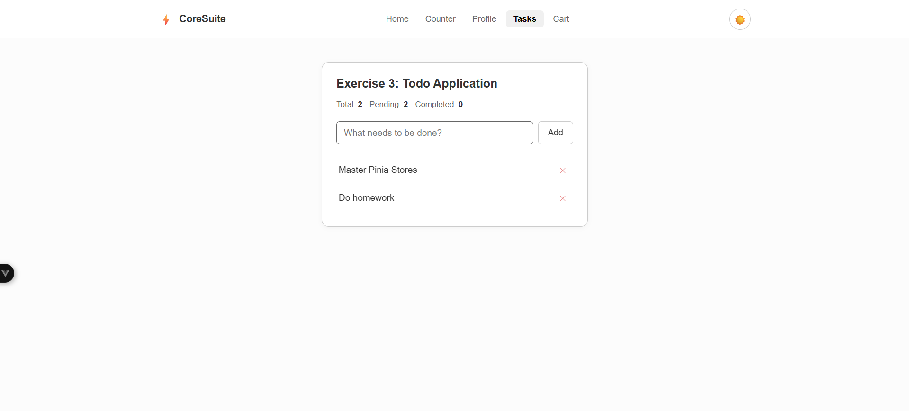
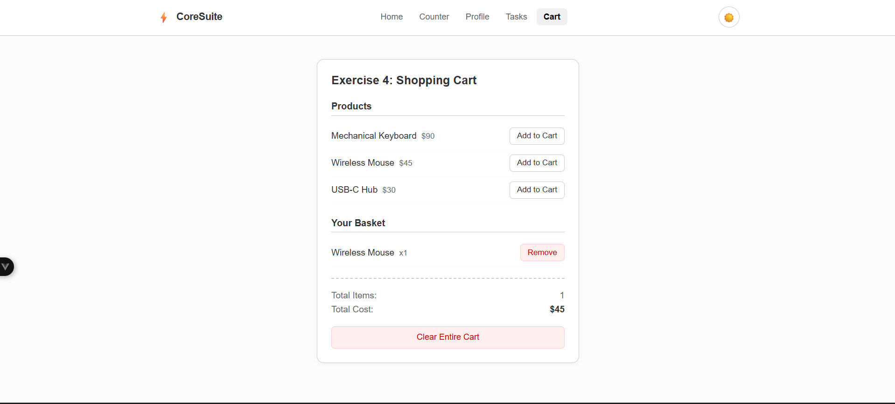
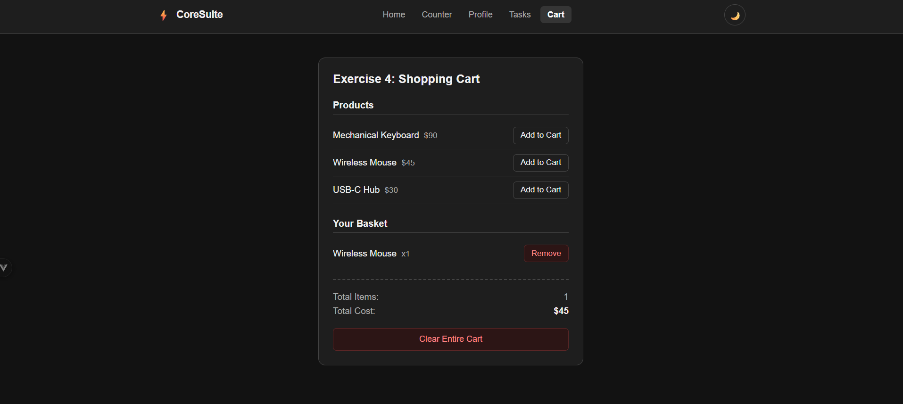

# ⚡ CoreSuite

A collection of 5 Pinia store exercises built with **Vue 3**, **Pinia**, and **Vue Router**.

---

## 📸 Screenshots

### Home Page


### Counter


### User Profile


### Todo List


### Shopping Cart


### Shopping Cart


---

## 🚀 Features

- **Counter** — increment, decrement, reset with double count computed value
- **User Profile** — edit name, age, and email with live preview
- **Todo List** — add, toggle, delete todos with pending/completed counters
- **Shopping Cart** — add/remove products, quantity tracking, total price
- **Theme Toggle** — switch between light and dark mode across all pages

---

## 🗂️ Project Structure

```
src/
├── components/
│   └── Navbar.vue        # Top navigation with theme toggle
├── views/
│   ├── HomeView.vue      # Landing page
│   ├── CounterView.vue   # Exercise 1: Counter
│   ├── UserView.vue      # Exercise 2: User Profile
│   ├── TodoView.vue      # Exercise 3: Todo List
│   ├── CartView.vue      # Exercise 4: Shopping Cart
│   └── NotFound.vue      # 404 page
├── stores/
│   ├── counter.js        # Counter store
│   ├── user.js           # User profile store
│   ├── todo.js           # Todo store
│   ├── cart.js           # Shopping cart store
│   └── theme.js          # Dark/light mode store
├── router/
│   └── index.js          # Vue Router config
└── App.vue               # Root component with theme class binding
```

---

## 🛠️ Tech Stack

| Tech | Purpose |
|---|---|
| Vue 3 | Frontend framework (Composition API) |
| Pinia | State management |
| Vue Router | Client-side routing |

---

## ⚙️ Setup & Installation

```bash
# Clone the repository
git clone https://github.com/your-username/coresuite.git

# Navigate to project folder
cd coresuite

# Install dependencies
npm install

# Start development server
npm run dev

# Build for production
npm run build
```

---

## 🗃️ Pinia Stores

### `counter.js`
| | Name | Description |
|---|---|---|
| **State** | `count` | Current count value |
| **Getters** | `doubleCount` | Count multiplied by 2 |
| **Actions** | `increment()` | Increase count by 1 |
| | `decrement()` | Decrease count by 1 |
| | `reset()` | Reset count to 0 |

### `user.js`
| | Name | Description |
|---|---|---|
| **State** | `name` | User's name |
| | `age` | User's age |
| | `email` | User's email |
| **Actions** | `updateName()` | Update name |
| | `updateAge()` | Update age |
| | `updateEmail()` | Update email |

### `todo.js`
| | Name | Description |
|---|---|---|
| **State** | `todos` | List of todo items |
| **Getters** | `completedTodos` | Filtered completed todos |
| | `pendingTodos` | Filtered pending todos |
| | `totalTodos` | Total todo count |
| **Actions** | `addTodo()` | Add new todo |
| | `deleteTodo()` | Remove todo by id |
| | `toggleTodo()` | Toggle completed state |

### `cart.js`
| | Name | Description |
|---|---|---|
| **State** | `products` | Available products list |
| | `cart` | Items in cart |
| **Getters** | `totalItems` | Total item quantity |
| | `totalPrice` | Total cart price |
| **Actions** | `addToCart()` | Add product to cart |
| | `removeFromCart()` | Remove product from cart |
| | `clearCart()` | Empty the cart |

### `theme.js`
| | Name | Description |
|---|---|---|
| **State** | `darkMode` | Dark mode toggle state |
| **Actions** | `toggleTheme()` | Switch dark/light mode |

---

## 📄 License

MIT