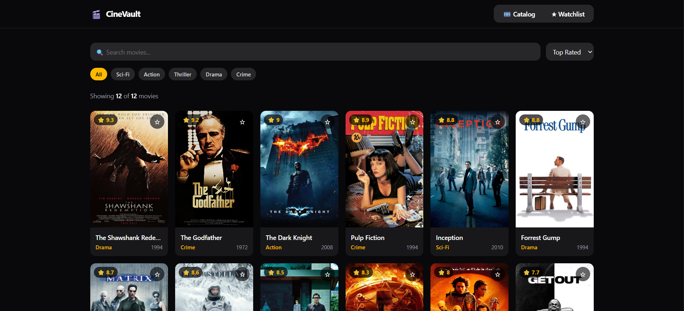
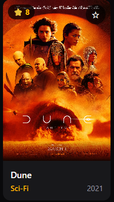
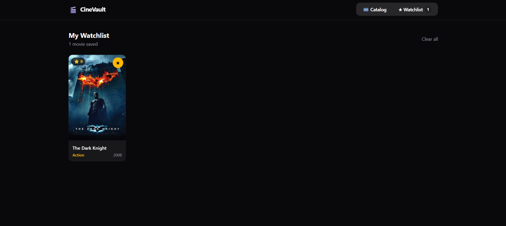
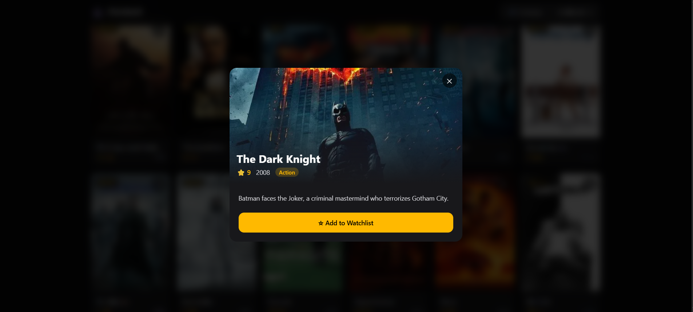

# 🎬 CineVault

A movie discovery and watchlist app built with **Vue 3**, **Pinia**, **Vue Router**, and **Tailwind CSS**.

---

## 📸 Screenshots

### Catalog Page


### Movie Detail Page


### Watchlist Page


### Movie Modal


---

## 🚀 Features

- Browse a catalog of 12 movies
- Search movies by title or genre
- Filter by genre and sort by rating, year, or title
- Add/remove movies from your watchlist
- View movie detail page with related movies
- Movie modal with quick info and watchlist toggle
- Dark/light mode not applicable (dark UI by default)
- Page transitions and smooth animations
- 404 Not Found page

---

## 🗂️ Project Structure

```
src/
├── components/
│   ├── Navbar.vue        # Top navigation with watchlist count badge
│   ├── MovieCard.vue     # Movie poster card with watchlist toggle
│   ├── MovieModal.vue    # Movie detail modal
│   └── SearchBar.vue     # Search, sort, and genre filter
├── views/
│   ├── CatalogView.vue   # Main movie grid page
│   ├── WatchlistView.vue # Saved movies page
│   ├── MovieDetail.vue   # Single movie detail page
│   └── NotFound.vue      # 404 page
├── stores/
│   ├── movieStore.js     # Movies data, search, filter, sort
│   ├── watchlistStore.js # Watchlist state
│   └── uiStore.js        # Modal open/close state
└── router/
    └── index.js          # Vue Router config
```

---

## 🛠️ Tech Stack

| Tech | Purpose |
|---|---|
| Vue 3 | Frontend framework (Composition API) |
| Pinia | State management |
| Vue Router | Client-side routing |
| Tailwind CSS | Utility-first styling |

---

## ⚙️ Setup & Installation

```bash
# Clone the repository
git clone https://github.com/your-username/cinevault.git

# Navigate to project folder
cd cinevault

# Install dependencies
npm install

# Start development server
npm run dev

# Build for production
npm run build
```

---

## 🗃️ Pinia Stores

### `movieStore.js`
| | Name | Description |
|---|---|---|
| **State** | `movies` | Full movie list |
| | `searchQuery` | Current search text |
| | `activeGenre` | Selected genre filter |
| | `sortBy` | Current sort field |
| **Getters** | `allGenres` | Unique genre list |
| | `filteredMovies` | Filtered + sorted movie list |
| | `totalMovies` | Total movie count |
| **Actions** | `setSearch()` | Update search query |
| | `setGenre()` | Update active genre |
| | `setSortBy()` | Update sort field |
| | `resetFilters()` | Reset all filters |

### `watchlistStore.js`
| | Name | Description |
|---|---|---|
| **State** | `watchlistIds` | Array of saved movie IDs |
| **Getters** | `watchlistCount` | Number of saved movies |
| | `isInWatchlist` | Check if movie is saved |
| **Actions** | `addToWatchlist()` | Add movie to watchlist |
| | `removeFromWatchlist()` | Remove movie from watchlist |
| | `toggleWatchlist()` | Toggle watchlist state |
| | `clearWatchlist()` | Clear all saved movies |

### `uiStore.js`
| | Name | Description |
|---|---|---|
| **State** | `selectedMovie` | Currently selected movie |
| **Getters** | `isModalOpen` | Whether modal is visible |
| **Actions** | `openModal()` | Open modal with movie |
| | `closeModal()` | Close modal |

---

## 📄 License

MIT